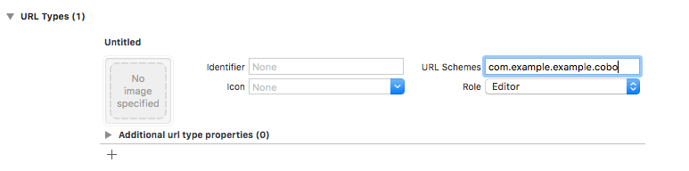

# CoboSDK-iOS
CoboSDK help develpers sign and broadcast ethereum transactions using [Cobo Wallet](https://cobo.com/).
Dapp developers can use CoboSDK to get user's ethereum addresses, sign messages, validate the signature, send transaction and call contract. Without the needs of developing private key management and wallet functions.

## Get Started

### Add dependency

- Cocoapods

Add the following line to your `Podfile`:
```ruby
pod 'CoboSDK'
```
then run `$ pod install`.

- Carthage
```
TODO
```

### Register URL Scheme for your app
Open Xcode and click on you project, click on `TARGETS`, go to the `Info` tab and click on `+` button in `URL Types` section
Enter a custom scheme name in `URL Schemes`. The scheme name should be as unique as possible.



Register the url scheme to CoboSDK:
```swift
CoboSDK.shared.setup(callbackScheme: <replace with your url scheme>)
```

### Add ```LSApplicationQueriesSchemes```
Add the following lines to ```Info.plist``` file：
```xml
<key>LSApplicationQueriesSchemes</key>
<array>
    <string>cobo-wallet</string>
</array>
```


### Handling callbacks
In `AppDelegate`, implement `func application(_ app: UIApplication, open url: URL, options: [UIApplicationOpenURLOptionsKey : Any] = [:]) -> Bool` to handle callbacks:
```swift
func application(_ app: UIApplication, open url: URL, options: [UIApplicationOpenURLOptionsKey : Any] = [:]) -> Bool {
    return CoboSDK.shared.application(app, open: url, options: options)
}
```

## Usage

### Sign message
```swift
let message = "Hello Cobo!"
CoboSDK.shared.signMessage(message: message) { result in
    switch result {
    case .success(let value):
        guard let address = value.address, let signature = value.signature else { break }
        print(address)
        let match = CoboSDK.shared.verifyMessage(address: address, signature: signature, message: message)
        print("\(match)")
    case .failure(let error):
        print(error.localizedDescription)
    }
}
```

### Send transaction
```swift
let gasPrice = BigUInt(stringLiteral: "1000000000") // 1 Gwei
let gasLimit = BigUInt(21000)
let value = BigUInt(stringLiteral: "1000000000000000000") // 1 ETH
let from = <replace with address in sign message result>
let to = <replace with address to transfer to>

let tx = EthereumTransaction(gasPrice: gasPrice, gasLimit: gasLimit, to: to, value: value, data: Data())
CoboSDK.shared.sendTransaction(transaction: tx, from: from) { result in
    switch result {
    case .success(let value):
        guard let hash = value.hash, let tx = value.rawTransaction else { break }
        print("hash: \(hash)")
    case .failure(let error):
        print(error.localizedDescription)
    }
}
```

For more use cases please refer to the  ```Example``` project.